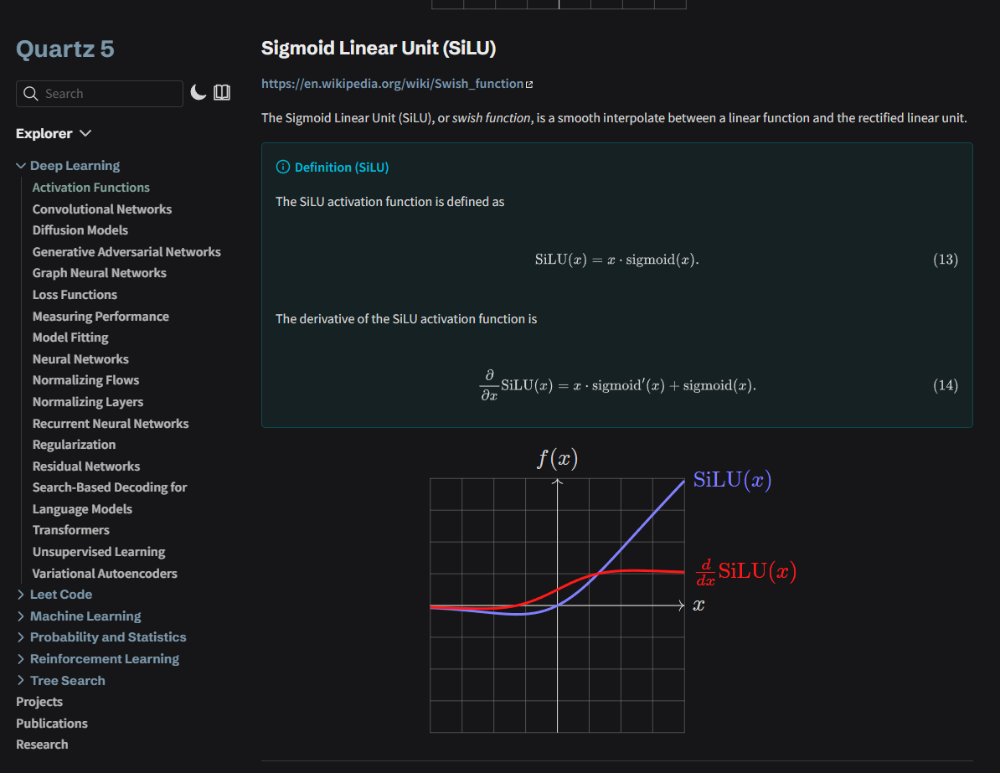

# TikZJax

Quartz v5 transformer plugin that renders `tikz` code blocks to inline SVG using `node-tikzjax`.

> [!NOTE]
> This matches the Obsidian community plugin [Obsidian TikZJax](https://github.com/artisticat1/obsidian-tikzjax), so tikz blocks should just work as-is.

## Demo

For the following codeblock in your notes, it does the following:
````
```tikz
\begin{document}
  \begin{tikzpicture}[domain=-4:4,scale=0.5]
    \draw[very thin,color=gray] (-4.0,-4.0) grid (4.0,4.0);
    \draw[->] (-4,0) -- (4.0,0) node[right] {$x$};
    \draw[->] (0,-4) -- (0,4.0) node[above] {$f(x)$};
    \draw[color=blue!50,line width=0.4mm,samples=100] plot (\x,{\x*(exp(\x))/(1+exp(\x))}) node[right] {$\mathrm{SiLU}(x)$};
    \draw[color=red!90,line width=0.4mm,samples=100] plot (\x,{ \x * ((exp(\x))/(1+exp(\x))) * (1-(exp(\x))/(1+exp(\x))) + ((exp(\x))/(1+exp(\x))) }) node[right] {$\frac{d}{dx}\mathrm{SiLU}(x)$};
  \end{tikzpicture}
\end{document}
```
````



## Install

```bash
npx quartz plugin add github:tuero/tikz-component
```

## Usage

Add it to `quartz.config.yaml`:

```yaml
plugins:
  - source: github:tuero/tikz-component
    enabled: true
    options:
      showConsole: false
      disableOptimize: true
```

## Options

| Option | Type | Default |
| --- | --- | --- |
| `showConsole` | `boolean` | `false` |
| `disableOptimize` | `boolean` | `true` |

## Notes

- Supports embedded pre-rendered SVG via code fence metadata like `alt="data:image/svg+xml;base64,..."`.
- Supports inline figure styling via code fence metadata like `style="max-width: 20rem"`.
- Includes the dark-mode stroke/fill overrides from the v4 implementation so black TikZ output adapts correctly in Quartz dark theme.
